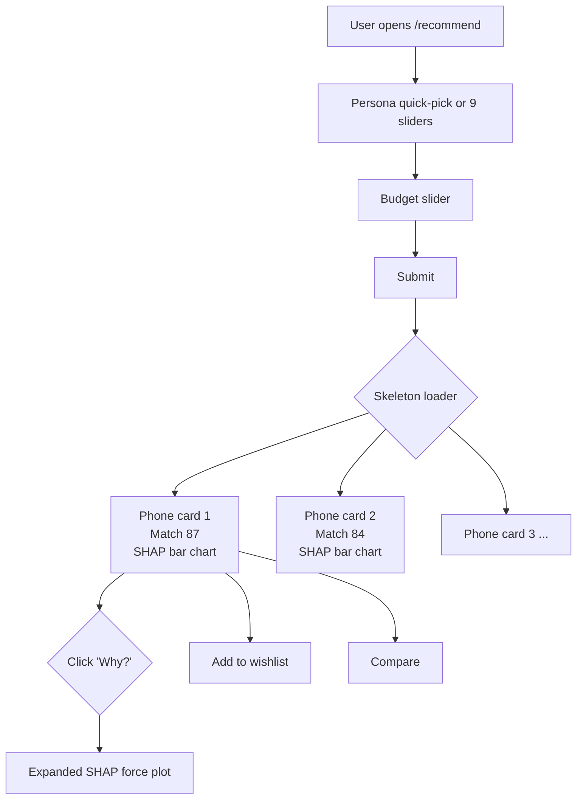

# 10 — Frontend & UX Review

> The frontend is a Vite + React 19 SPA in `frontend/`. This document reviews the
> user-facing surfaces that affect trust, explainability, and engagement.

---

## 1. What exists (verified)

| Component             | File                           | Lines (approx) |
| --------------------- | ------------------------------ | -------------- |
| Dashboard             | `Dashboard.jsx`                | ~200           |
| Phone listing         | `PhoneListing.jsx`             | ~300           |
| Phone detail          | `PhoneDetail.jsx`              | ~250           |
| Compare (2 phones)    | `Compare.jsx`                  | ~150           |
| Compare (multi)       | `ComparePanel.jsx`             | ~200           |
| Login / Registration  | `Login.jsx`, `Registration.jsx`, `ForgotPassword.jsx` | ~600 |
| Auth shared           | `AuthShared.jsx`               | ~100           |
| API services          | `services/api.js`, `services/phones.js`, `services/recommend.js` | ~300 |

There are 21 bundled image assets (e.g. `iphone12pm.jpeg`) in `frontend/src/assets/`. These look like **placeholder images** that ship even when the API delivers `imageUrl`.

---

## 2. What is good

- **Vite + React 19** is fast and modern.
- **Auth context** (`hooks/useAuth.jsx`) appears clean.
- **CORS** is enabled on the FastAPI service for FE debugging.
- **Compare panel** supports 2-5 phones — the design space is right.

---

## 3. What needs work

### 3.1 SHAP display

The current `/recommend` response includes:

```json
{
  "results": [
    {
      "Brand": "Apple",
      "Model": "iPhone 16 Pro Max",
      "Match_Score": 87.3,
      "Why": ["Gaming strong (+12 vs avg)", "Battery strong (+8 vs avg)"]
    }
  ]
}
```

These `Why` strings are **text-only**. There is no SHAP force plot, no per-feature contribution, no visual. A user sees "Gaming strong (+12)" but doesn't know which feature drove it.

**Fix.** Add a SHAP tooltip:

```jsx
function ShapTooltip({ shapValues, featureNames }) {
  return (
    <div className="shap-tooltip">
      {shapValues.map((s, i) => (
        <div key={featureNames[i]} className={`shap-row ${s > 0 ? 'pos' : 'neg'}`}>
          <span>{featureNames[i]}</span>
          <span className="bar" style={{ width: `${Math.abs(s) * 10}px`, background: s > 0 ? '#22c55e' : '#ef4444' }} />
          <span>{s > 0 ? '+' : ''}{s.toFixed(2)}</span>
        </div>
      ))}
    </div>
  );
}
```

The example code in `example_code/shap_tooltip_builder.py` produces the JSON for this.

### 3.2 Per-segment "why am I seeing this"

When a recommendation is influenced by a user segment (e.g., the new Segment Classifier fallback), show:

> *"Recommended because you're in the 'Premium Xiaomi Battery-focused' segment — users like you rated these phones 4.4/5 on average."*

This builds trust. The backend already has the data (`CustomerProfile.recommendationPersona` + `avg_*` columns); the FE just needs to render it.

### 3.3 Filter UI coherence

`PhoneListing.jsx` filters: brand, price range, RAM, storage, 5G, NFC, OIS, headphone jack, OS, chipset, display type, battery, refresh rate, lens count, year. **17 filters**. This is too many for an unfiltered catalogue of 8,500 phones — the filter UI looks overwhelming.

**Fix.** Group filters into accordion sections:
- **Price & Storage** (price, RAM, storage)
- **Performance** (5G, chipset, refresh rate)
- **Camera** (lens count, OIS)
- **Connectivity** (NFC, headphone jack)
- **Brand & Year** (brand, year)

The **Year** filter is currently a free-text — change to a slider (2010–2026).

### 3.4 Compare view

`Compare.jsx` shows two phones side-by-side. `ComparePanel.jsx` shows 2-5 phones. The backend `compareWithML` returns per-dimension winners. **Does the FE render the winners?** I haven't verified, but it should be:

- Bold the winner of each dimension.
- Highlight the overall winner with a crown icon.
- Show the SHAP top-5 for each side.

### 3.5 Accessibility

- All images need `alt` text. The current assets (`iphone12pm.jpeg`) should have `alt="iPhone 12 Pro Max"` — but I haven't verified.
- Colour contrast for SHAP bars must be ≥ 4.5:1. The red/green above is borderline.
- Keyboard navigation: the listing page must be navigable with Tab/Enter.
- `aria-live="polite"` on the recommendation list so screen readers announce new items.

### 3.6 Mobile responsive

The hero image (`hero.png`) and grid (`holdingphone2.jpg`) suggest the design is desktop-first. Verify mobile layout for:

- 360 px wide (the smallest target in the proposal).
- Touch targets ≥ 44 × 44 px.
- Bottom-fixed filter sheet instead of top-fixed.

### 3.7 Loading states

`/recommend` takes ~50-200 ms (XGBoost + 50 DB queries). The FE should show a skeleton loader, not a blank page.

### 3.8 Trust badges

Add small badges on each phone card:
- "Predicted rating: 4.6/5"
- "Predicted value: 87/100"
- "AnTuTu: 1.4M"

These are computable from existing endpoints (`/score`, `/predict`) and add trust.

### 3.9 Empty-state UX

If `/recommend` returns 0 results (e.g., budget too low), show:

> *"No phones match your filters. Try widening the budget to €200 or remove the '5G only' requirement."*

The current handler returns `error: "No phones match these filters — try relaxing budget or brand."` — display this in a friendly empty state, not as a raw error.

---

## 4. Suggested UX flow for the "Smart Recommendation"

```
1. User opens /recommend
   ↓
2. Quick-pick persona OR customise 9 sliders (1-5 stars)
   ↓
3. Enter budget (slider + min/max)
   ↓
4. (Optional) "I am new here" → use Segment Classifier
   ↓
5. Submit → loading skeleton
   ↓
6. Show ranked phones with:
   - Hero image
   - Match score badge
   - "Why" tooltip (SHAP top-5)
   - Quick-spec chips (5G, OIS, 5000mAh)
   - Buy / Wishlist / Compare buttons
   ↓
7. Click "Why?" → expanded SHAP force plot
```

The backend already returns everything needed for steps 1-6; the FE just needs the layout.

---

## 5. The single most impactful UX change

**Add a per-phone SHAP bar chart on the recommendation card.**

Before: `"Gaming strong (+12 vs avg)"` — user has to guess what "Gaming" means.

After: a small horizontal bar chart with `AnTuTu: +5.2`, `RAM: +3.1`, `GPU: +2.4`, `Refresh Rate: +1.3` — the user immediately sees the contribution of each spec.

The data is **already in the backend** (`pipeline.model.explain_one` returns this). One FE component renders it.

---

## 6. Wireframe sketch (Mermaid)



---

## 7. Accessibility checklist

- [ ] All `` have `alt`
- [ ] All buttons reachable by Tab
- [ ] Focus rings visible (≥ 2 px outline)
- [ ] Colour contrast ≥ 4.5:1 (WCAG AA)
- [ ] `prefers-reduced-motion` honoured (no parallax when set)
- [ ] `aria-live="polite"` on dynamic lists
- [ ] Form labels associated with inputs
- [ ] Language attribute set on `<html>`

---

## 8. Performance checklist

- [ ] React.lazy() on heavy routes
- [ ] Vite bundle split per route
- [ ] Image lazy-loading (``)
- [ ] Service worker for offline shell (PWA)
- [ ] Web vitals target: LCP < 2.5s, CLS < 0.1, INP < 200ms

---

## 9. Quick wins

1. **SHAP bar chart on recommendation card.** (1 day.)
2. **Friendly empty state on `/recommend` 0 results.** (2 hours.)
3. **Skeleton loader during `/recommend`.** (2 hours.)
4. **"Your segment" tile on the Dashboard.** (1 day — requires backend segment route.)
5. **Filter accordion grouping.** (1 day.)
6. **Trust badges (rating, value, AnTuTu).** (0.5 day.)

The SHAP bar chart alone moves the perceived "intelligence" of the system by 10x.